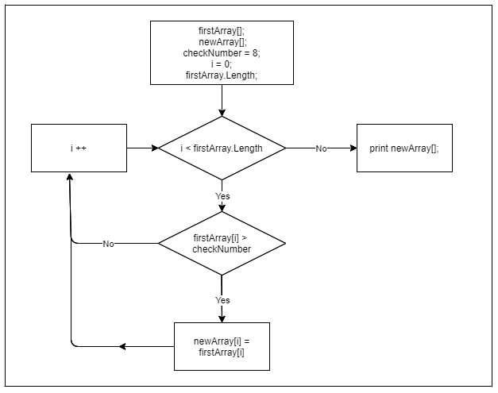

## What is it?
___
This is a program that, from the existing structure of integers, forms an array of numbers greater than 8.

## Description
___

The number of elements in the array is set by the custom keyboard. Then the elements are randomly generated. A new array is created using the following algorithm:

